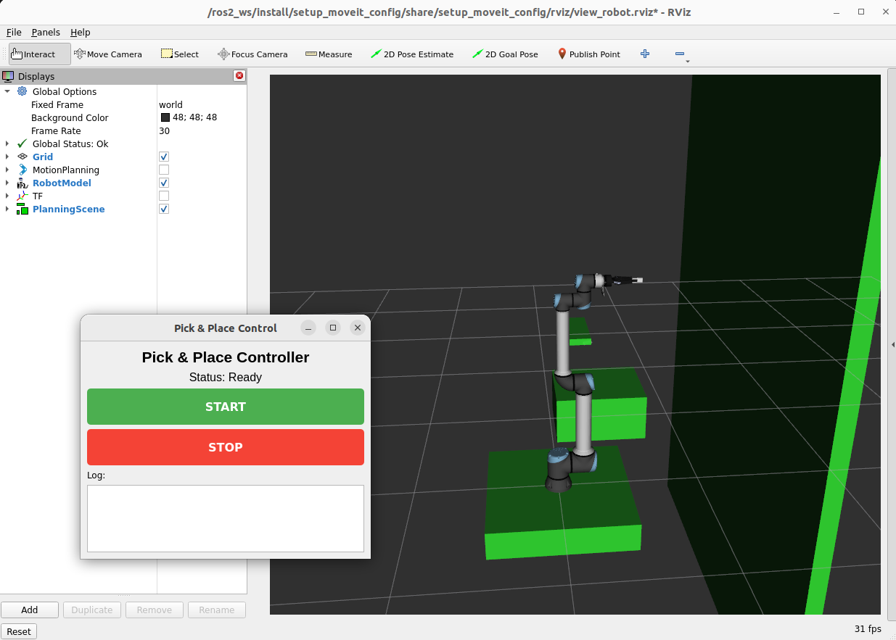

# Technical Documentation: Vision-Based Autonomous Robot Pick and Place System

## Table of Contents
1. [Introduction](#introduction)
2. [Hardware & Prerequisites](#hardware--prerequisites)
3. [Quick Start](#quick-start)
4. [Configuration and Setup](#configuration-and-setup)
5. [ROS 2 Fundamentals](#ros-2-fundamentals)
6. [MoveIt Overview](#moveit-overview)
7. [System Architecture](#system-architecture)
8. [Package Descriptions](#package-descriptions)
9. [Data Flow and Communication](#data-flow-and-communication)
10. [Key Concepts](#key-concepts)
11. [Development Guide](#development-guide)
12. [Troubleshooting](#troubleshooting)
13. [Contributors & License](#contributors--license)

---

## Introduction

This workspace implements a complete autonomous pick-and-place system using a UR10e collaborative robot arm. It integrates:
- **Robot Control**: Via ROS 2 and the UR10e driver
- **Motion Planning**: Using MoveIt 2 for trajectory planning
- **Perception**: Computer vision with FoundationPose for 6D pose estimation
- **Gripper Control**: Robotiq 2F-140 gripper integration
- **User Interface**: PyQt5-based GUI for task control

**Target audience**: Users new to ROS 2, robotics, and motion planning frameworks.

### Workspace Packages

| Package | Purpose |
|---------|----------|
| `setup_launch` | Main launch files for the complete system |
| `setup_description` | URDF descriptions and robot configuration |
| `setup_moveit_config` | MoveIt configuration for motion planning |
| `pick_and_place` | Pick-and-place manipulation application (C++) |
| `pick_and_place_gui` | GUI for pick-and-place control |
| `vision_pipeline` | Object detection and pose estimation using FoundationPose |
| `camera_positioning` | Camera positioning and calibration |
| `cam_flange_support` | Custom camera mount for UR flange |

---

## Hardware & Prerequisites

### Hardware Requirements

- **Robot**: UR10e collaborative robot
- **End Effector**: Robotiq 2F-140 gripper
- **Camera**: Intel RealSense D456 (or any other RealSense depth camera) mounted on a custom flange
- **PC / Edge Computer**: Ubuntu 22.04 with GPU (for perception and planning)

### Prerequisites

- **Git** installed for cloning repositories
- **Docker** and **docker-compose** (for containerized setup)
- **RealSense SDK** ([installation instructions](https://github.com/IntelRealSense/librealsense/blob/master/doc/distribution_linux.md#installing-the-packages))
- **UR Robot Setup**: Robotiq Gripper URCap **must be uninstalled** from the UR teach pendant before running this workspace

---

## Quick Start

```bash
# 1. Clone or navigate to the workspace
cd eurobots_ws

# 2. Configure X11 access for Docker
xhost +local:docker

# 3. Build and launch the container
docker compose up --build

# 4. Click START to launch the Pick and Place task
```



---

## Configuration and Setup

### File Configuration

Before running the system, configure the following files to match your hardware setup and environment:

#### `pick_and_place/config/configuration.yaml`

This file defines the pick-and-place task parameters:

| Parameter | Purpose |
|-----------|----------|
| **arm_move_group** | MoveIt planning group name for the robotic arm (e.g., "ur_manipulator") |
| **gripper_move_group** | MoveIt planning group name for the gripper (e.g., "gripper") |
| **pre_pick_frame** | TF frame for the pre-approach position before picking |
| **pre_place_frame** | TF frame for the pre-approach position before placing |
| **home_position** | Named joint configuration for the rest/home position |
| **observation_position** | Named joint configuration for detection service position |
| **gripper_open_position** | Named gripper configuration for open state |
| **gripper_closed_position** | Named gripper configuration for grasping state |
| **detect_service_name** | ROS service name for object detection |
| **pick_approach_distance** | Distance (meters) for final approach along gripper Z-axis |
| **place_leave_distance** | Distance (meters) to retreat after placing |
| **lift_distance** | Distance (meters) to lift object after grasping |
| **drop_distance** | Distance (meters) to lower object before releasing |
| **object_id** | Identifier for collision object in MoveIt |
| **object_length/width/height** | Dimensions of the object being picked (meters) |

#### `pick_and_place/config/obstacles.yaml`

This file defines collision objects in the planning scene:

- **id**: Unique identifier for each obstacle
- **type**: Geometry type (box, sphere, cylinder, or mesh)
- **frame**: Reference frame (typically "world")
- **size/radius/height**: Dimensions of the obstacle
- **position**: [x, y, z] coordinates in the reference frame
- **orientation**: [x, y, z, w] quaternion (rotation)

**Current obstacles include:**
- `boxes`: Main workspace boundary box
- `table`: Work surface with negative Z to avoid collision below table
- `obstacle`: Barrier in the workspace
- `cell`: Boundary constraint

#### `setup_description/urdf/robot.urdf.xacro`

Key sections to configure:

**Camera Position & Extrinsics:**
```xml
<xacro:sensor_d435 parent="base_link" use_nominal_extrinsics="$(arg use_nominal_extrinsics)">
  <origin xyz="-1.090329 0.318755 0.635220" rpy="-0.015609 0.316050 0.494161"/> <!-- CALIBRATED CAMERA EXTRINSICS -->
</xacro:sensor_d435>
```
- **xyz**: Camera position relative to base_link (meters)
- **rpy**: Camera orientation in roll-pitch-yaw (radians)

**Place Frame:**
```xml
<joint name="object_place_joint" type="fixed">
  <parent link="world"/>
  <child link="object_place"/>
  <origin xyz="-0.220 0.587 0.152" rpy="-3.083 0.018 -1.727"/> <!-- SET OBJECT PLACE FRAME -->
</joint>
```
- **xyz**: Place location position in world frame (meters)
- **rpy**: Place orientation in world frame (radians)

**Related Frames:**
- `charuco_board`: Calibration frame attached to gripper
- `ee_link`: End-effector virtual link at fingertips (0.22m offset along Z-axis from tool0)

All coordinates must be calibrated and match your actual hardware setup.

### Camera Positioning Calibration

To position the camera, you first need a printed DICT_4X4 ChArUco board placed in a known and fixed location visible by the camera.

Adjust the pose of the board in `setup_description/urdf/robot.urdf.xacro`:

```xml
<joint name="charuco_board_joint" type="fixed">
    <parent link="robotiq_base_link"/>
    <child link="charuco_board"/>
    <origin xyz="-0.15 0 0.15" rpy="0 0 -1.5708"/>
</joint>
```

- **xyz**: Place location position in world frame (meters)
- **rpy**: Place orientation in world frame (radians)

Then, enter the container interactively:

```bash
docker exec -it pick_and_place bash
```

Run the camera positioning algorithm:

```bash
ros2 run camera_positioning diamond_detector --ros-args -p camera_topic:=/camera/color/image_raw -p board_length:=0.225 -p camera_base_frame:=camera_link -p base_frame:=base_link -p board_frame:=charuco_board
```

**NOTE**: Adjust board_length to match the actual size of your ChArUco board.

The algorithm will output the camera's position relative to base_link. Use this information when configuring the `robot.urdf.xacro` file.

For more information, refer to [the camera_positioning package documentation](camera_positioning/README.md).

---

## ROS 2 Fundamentals

### What is ROS 2?

ROS 2 (Robot Operating System 2) is a flexible framework for writing robot software. Think of it as a **middleware** that allows different robot components (robot driver, motion planner, perception system, user interface) to communicate with each other in a standardized way.

**Key analogy**: If a robot is like a human body, ROS 2 is like the nervous system—it carries messages between different parts so they can coordinate.

### Core Concepts

#### 1. **Nodes**
A **node** is a single executable program that performs a specific task.

Examples in this system:
- `pick_and_place_node`: Controls the pick-and-place sequence
- `pose_estimator_service`: Estimates object poses using computer vision
- `robot_state_publisher`: Broadcasts robot structure information
- `pick_and_place_gui`: PyQt5 GUI for user control

**Execution**: Nodes run as separate processes (similar to applications on your computer) and communicate via ROS mechanisms.

```cpp
// Example: Creating a simple ROS 2 node (pick_and_place_node.cpp)
class PickAndPlaceNode : public rclcpp::Node {
public:
    PickAndPlaceNode() : Node("pick_and_place_node") {
        // Node initialization
    }
};
```

#### 2. **Topics**
A **topic** is a named channel for sending messages between nodes using a **publish-subscribe** pattern.

**How it works**:
```
Publisher (sends data) ---> Topic (channel) ---> Subscribers (receive data)
```

**Example**: The camera publishes images on topics:
- `/camera/color/image_raw`: RGB images from camera
- `/camera/depth/image_rect_raw`: Depth images (distance to objects)

Subscribers listening to these topics can react to new images immediately.

**Analogy**: Like a radio station (publisher) broadcasting on a frequency (topic) that radios (subscribers) can tune into.

```python
# Example: Subscribing to camera images (vision_node.py)
self.create_subscription(
    Image, 
    self.rgb_topic,           # Topic name: /camera/color/image_raw
    self.rgb_callback,        # Function called when new image arrives
    10                        # Queue size: keep 10 latest messages
)
```

#### 3. **Services**
A **service** is a **request-response** communication pattern. One node asks another node to perform a task and waits for the result.

**How it works**:
```
Client (requests) --> Service (processes) --> Server (responds with result)
```

**Example**: Object detection service
- **Request**: "Please detect the object in the current camera view"
- **Response**: "Object detected at pose [x, y, z, rx, ry, rz]"

This is different from topics because:
- Topics are **asynchronous** and **one-way** (fire and forget)
- Services are **synchronous** (caller waits for response)

```python
# Example: Creating a service server (vision_node.py)
self.create_service(
    Trigger,                  # Service type (request with no args, response with success/message)
    "estimate_pose",          # Service name
    self.estimate_pose_callback  # Function that handles requests
)

# Example: Calling a service (pick_and_place_node.cpp)
auto request = std::make_shared<std_srvs::srv::Trigger::Request>();
auto future = detect_client_->async_send_request(request);
future.wait();  // Wait for response
auto response = future.get();
```

#### 4. **Parameters**
**Parameters** are configuration values that nodes can read at startup or runtime.

**Example parameters** (from `pick_and_place/config/configuration.yaml`):
```yaml
arm_move_group: "ur_manipulator"        # Name of the arm in MoveIt
gripper_move_group: "gripper"           # Name of the gripper in MoveIt
pick_approach_distance: 0.05            # Distance to approach in meters
home_position: "home"                   # Named joint configuration
```

Nodes read these at startup:
```cpp
std::string arm_group = this->get_parameter("arm_move_group").as_string();
```

**Benefits**: Change behavior without recompiling code.

#### 5. **Transform (TF)**
A **transform** describes the position and orientation of one coordinate frame relative to another.

**Example frames** in this system:
- `world`: Global reference frame
- `base_link`: Robot base
- `tool0`: Robot end-effector
- `camera_link`: Camera optical center
- `object`: The object being picked

**Why transforms matter**: To pick an object, you need to know "where is the object relative to the robot?"

```
world ─> base_link ─> tool0 (end-effector)
              │
              └──> camera_link ─> object
```

**In code**: Looking up a transform
```cpp
geometry_msgs::msg::TransformStamped transform = 
    tf_buffer.lookupTransform("base_link", "camera_link", tf2::TimePointZero);
```

This asks: "What is the position and orientation of camera_link relative to base_link?"

---

## MoveIt Overview

### What is MoveIt?

**MoveIt** is a motion planning library that solves the problem: **"How do I move my robot arm from point A to point B while avoiding collisions?"**

Think of it as a **GPS for robots**—just like Google Maps finds a route avoiding traffic, MoveIt finds a collision-free path for the robot.

### Key Problems MoveIt Solves

#### 1. **Inverse Kinematics (IK)**
**Problem**: You know where you want the gripper to be in space, but not what joint angles to use.

**Example**: 
- Desired gripper position: [0.5, 0.3, 0.8] meters (x, y, z)
- Required joint angles: [45°, 120°, -90°, 30°, 60°, 0°]

MoveIt computes the joint angles needed to reach any 3D position.

```cpp
// Example: Set gripper position (pick_and_place_node.cpp)
geometry_msgs::msg::PoseStamped target_pose;
target_pose.pose.position.x = 0.5;
target_pose.pose.position.y = 0.3;
target_pose.pose.position.z = 0.8;
target_pose.pose.orientation = /* ... quaternion ... */;

arm_->setPoseTarget(target_pose);  // MoveIt solves IK internally
```

#### 2. **Path Planning**
**Problem**: A straight line from current position to target might pass through obstacles.

**Solution**: MoveIt uses algorithms (like OMPL) to find a collision-free path.

```
Start (current pose) ~~~ [AVOIDING OBSTACLES] ~~~ Goal (target pose)
```

#### 3. **Collision Detection**
MoveIt maintains a **planning scene**—a 3D model of:
- The robot and all its parts
- The environment (table, obstacles, etc.)
- Objects being manipulated

Before executing any motion, MoveIt checks if the path collides with anything.

### MoveIt Configuration

MoveIt is configured via:

**1. URDF (Unified Robot Description Format)**
- Describes the robot's structure: links (rigid parts) and joints (connections)
- Defines the kinematic chain: base → shoulder → arm → wrist → gripper

**2. SRDF (Semantic Robot Description Format)**
- Groups of joints (e.g., "ur_manipulator" = all arm joints)
- Named positions (e.g., "home" = predefined safe configuration)
- End-effector information (e.g., "tool0" is the gripper)

**Example named position** (configuration.yaml):
```yaml
home_position: "home"  # Robot returns to this safe position
```

This refers to a named configuration defined in the SRDF.

**3. MoveIt Configuration Package**
Located in `setup_moveit_config/`, contains:
- `config/ur10e.srdf`: Robot definition
- `config/kinematics.yaml`: Solver for inverse kinematics
- `config/controllers.yaml`: How to command the robot
- `config/joint_limits.yaml`: Maximum speeds and accelerations
- `launch/`: Files to start MoveIt

### MoveIt Planning Groups

A **planning group** is a set of joints that move together as a unit.

In this system:
```yaml
arm_move_group: "ur_manipulator"    # All 6 arm joints
gripper_move_group: "gripper"       # Gripper joints (open/close)
```

Each group has its own inverse kinematics solver.

---

## System Architecture

### High-Level Data Flow

```
┌─────────────────────────────────────────────────────────────┐
│                  Pick and Place GUI                          │
│               (pick_and_place_gui.py)                        │
│                                                               │
│  [START Button] ──┐                                          │
│  [STOP Button]  ──┼──> ROS Service Call (Trigger)           │
└────────────────────┼──────────────────────────────────────────┘
                     │
                     ▼
┌─────────────────────────────────────────────────────────────┐
│            Pick and Place Controller Node                    │
│         (pick_and_place_node.cpp)                           │
│                                                               │
│  1. Move arm to observation position                         │
│  2. Call vision service: "Detect object"                     │
│  3. Get object pose from TF broadcasts                       │
│  4. Plan pick trajectory (using MoveIt)                      │
│  5. Plan place trajectory (using MoveIt)                     │
│  6. Execute and control gripper                             │
└─────────────────────────────────────────────────────────────┘
     │                    │                      │
     │                    │                      │
     ▼                    ▼                      ▼
┌─────────────┐  ┌──────────────┐  ┌─────────────────────┐
│   MoveIt    │  │  Vision      │  │  Robot Driver       │
│             │  │  Pipeline    │  │  (UR Controller)    │
│ - Planning  │  │              │  │                     │
│ - IK Solver │  │ - Camera     │  │ - Low-level ctrl    │
│ - Collision │  │ - FoundPose  │  │ - Joint control     │
│   Check     │  │ - TF Publish │  │ - Safety           │
└─────────────┘  └──────────────┘  └─────────────────────┘
     │                    │                      │
     └────────────────────┴──────────────────────┘
              ROS 2 Communication
            (Topics, Services, TF)
                     │
                     ▼
              ┌──────────────┐
              │  UR10e Robot │
              │   Robotiq    │
              │   Gripper    │
              │   Camera     │
              └──────────────┘
```

### Process Execution

When you click START in the GUI:

```
1. GUI sends Trigger service request
   └─> Wakes up pick_and_place_node

2. pick_and_place_node:
   ├─> Move arm to observation position
   ├─> Request object detection from vision_node
   │   └─> vision_node:
   │       ├─ Wait for camera images
   │       ├─ Run FoundationPose algorithm
   │       ├─ Get 6D pose (position + orientation)
   │       └─ Publish as TF transform
   ├─> Read object pose from TF
   ├─> Ask MoveIt to plan approach trajectory
   ├─> Execute approach (move robot)
   ├─> Close gripper
   ├─> Ask MoveIt to plan lift trajectory
   ├─> Execute lift (move robot)
   ├─> Ask MoveIt to plan place trajectory
   ├─> Execute place trajectory
   ├─> Open gripper
   ├─> Ask MoveIt to plan retreat trajectory
   └─> Execute retreat, return to home
```

---

## Package Descriptions

### 1. `setup_description`
**Purpose**: Defines the complete robot structure

**Contents**:
- `urdf/robot.urdf.xacro`: Master robot description file
  - Includes UR10e arm (from `ur_description`)
  - Includes Robotiq gripper (from `robotiq_description`)
  - Adds custom components: camera mount, calibration board
  - Defines coordinate frames and transforms

**Key features**:
```xml
<!-- Robot composition -->
<robot name="ur10e_with_gripper">
  <xacro:include filename="$(find ur_description)/urdf/ur.urdf.xacro"/>
  <xacro:include filename="$(find robotiq_description)/urdf/robotiq_gripper.urdf.xacro"/>
  
  <!-- Custom camera mount -->
  <joint name="camera_joint" type="fixed">
    <parent link="tool0"/>
    <child link="camera_link"/>
    <origin xyz="0 0 0.05" rpy="0 0 0"/>
  </joint>
</robot>
```

**Why it matters**: Without this, MoveIt wouldn't know the robot's structure. It uses it to:
- Calculate reachable positions
- Detect self-collisions
- Know where the gripper is

### 2. `setup_moveit_config`
**Purpose**: MoveIt configuration for motion planning

**Key files**:
- `config/ur10e.srdf`: Semantic robot description
  - Defines planning groups: "ur_manipulator" (arm), "gripper"
  - Defines named positions: "home", "observation_position"
  - Specifies collision behavior between links

- `config/kinematics.yaml`: Inverse kinematics settings
  ```yaml
  ur_manipulator:
    kinematics_solver: ur_kinematics/UR10eKinematicsPlugin
    kinematics_solver_search_resolution: 0.005  # Search step in radians
    kinematics_solver_timeout: 0.05  # Timeout in seconds
  ```

- `launch/move_group.launch.py`: Starts the MoveIt service
  - Initializes the planning scene
  - Loads collision geometry
  - Starts the planning service that other nodes can call

### 3. `pick_and_place`
**Purpose**: Main task execution logic

**Main component**: `pick_and_place_node.cpp`

**Key capabilities**:
- **Reads configuration** from `config/configuration.yaml`
- **Implements pick routine**:
  ```
  1. Move to observation position
  2. Call vision service for object detection
  3. Extract object pose from TF transforms
  4. Plan approach trajectory (move down to object)
  5. Close gripper
  6. Plan lift trajectory (move up with object)
  7. Attach object to gripper in planning scene
  ```
  
- **Implements place routine**:
  ```
  1. Plan place trajectory (move to place location)
  2. Lower object
  3. Open gripper
  4. Plan retreat trajectory (move up and away)
  5. Detach object from planning scene
  ```

- **MoveIt integration**:
  ```cpp
  // Create planning interface
  auto arm = std::make_shared<moveit::planning_interface::MoveGroupInterface>(
      node_, "ur_manipulator"  // Planning group name
  );
  
  // Set target pose (where to move the gripper)
  arm->setPoseTarget(target_pose);
  
  // Plan motion
  moveit::planning_interface::MoveGroupInterface::Plan plan;
  bool success = (arm->plan(plan) == moveit_msgs::msg::MoveItErrorCodes::SUCCESS);
  
  // Execute if planning succeeded
  if (success) {
      arm->execute(plan);
  }
  ```

**Collision handling**:
```cpp
// Add object to scene so planner can avoid it
moveit_msgs::msg::CollisionObject collision_object;
collision_object.id = "picked_object";
collision_object.header.frame_id = "base_link";

// After planning, attach object to gripper
arm->attachObject(object_id_);  // Now planner won't collide with it
```

### 4. `pick_and_place_gui`
**Purpose**: User interface for starting/stopping tasks

**Technology**: PyQt5 (Python GUI library)

**How it works**:
```python
# Create service client
self.start_client = self.create_client(Trigger, 'start_pick_place')

# When user clicks button
def call_start(self):
    request = std_srvs.srv.Trigger.Request()
    self.start_client.call_async(request)
```

### 5. `vision_pipeline`
**Purpose**: Object detection and 6D pose estimation

**Key algorithm**: **FoundationPose** (NVIDIA research)
- Takes RGB and depth images
- Uses deep learning to detect object
- Estimates 6D pose: position (x, y, z) + orientation (roll, pitch, yaw)

**Flow**:
```
Camera Input (RGB + Depth)
    │
    ├─> Segment object using SAM (Segment Anything Model)
    │
    ├─> Get object bounding box
    │
    ├─> FoundationPose registration
    │   └─> Iteratively refine pose estimate
    │
    └─> Output: 6D pose (position + orientation)
           │
           └─> Publish as TF transform
                (so pick_and_place_node can read it)
```

**Example output**: Object detected at
```
Position: [0.5, 0.2, 0.1] meters (x, y, z in camera frame)
Orientation: [0.707, 0, 0, 0.707] (quaternion rotation)
```

### 6. `camera_positioning`
**Purpose**: Calibrate camera position relative to robot

**What it does**:
1. User places a printed ChArUco board at known position
2. Node detects the board with high precision
3. Computes camera position from board detection
4. Outputs the transform to add to URDF

**Why needed**: For vision to work, system must know "where is the camera relative to the robot?"

---

## Data Flow and Communication

### Example: Complete Pick and Place Sequence

```
TIME    GUI              pick_and_place     MoveIt      vision_node
─────   ──────────────   ──────────────     ──────      ────────────
  │
  ├──[Click START]───→
  │
  │                     1. Move to observe position
  │                     ├──→ Query MoveIt for plan
  │                     │      └──→ [Collision checking]
  │                     │          └──→ [Return trajectory]
  │                     └──→ Execute trajectory
  │                         └──→ Wait for joint state
  │
  │                     2. Request object detection
  │                     ├──────────────────────────────→
  │                     │                               
  │                     │                      Wait for camera frame
  │                     │                      ├──→ [Get RGB image]
  │                     │                      ├──→ [Get depth]
  │                     │                      ├──→ [Get camera params]
  │                     │                      ├──→ [Run FoundationPose]
  │                     │                      ├──→ [Broadcast TF]
  │                     │←──────────────────────[Return success]
  │                     
  │                     3. Read object pose from TF
  │                     ├──→ lookupTransform("base_link", "object")
  │                     │    └──→ [TF receives transform from vision_node]
  │                     │        └──→ Return object pose
  │                     
  │                     4. Plan pick trajectory
  │                     ├──→ Calculate approach pose
  │                     ├──→ Query MoveIt
  │                     │    └──→ [Solve IK, plan path, check collisions]
  │                     │        └──→ Return plan
  │                     └──→ Execute trajectory
  │
  │                     5. Close gripper
  │                     └──→ Publish gripper command
  │
  │                     6. Attach object in planning scene
  │                     └──→ MoveIt won't plan collisions with it
  │
  │                     7. Plan lift trajectory
  │                     └──→ Query MoveIt (object now attached)
  │
  │                     8. Plan place trajectory
  │                     └──→ Query MoveIt
  │
  │                     9. Open gripper, retreat
  │
  │                     10. Detach object
  │                     └──→ Remove from planning scene
  │
  └──[Status: Done]←──
```

### Coordinate Frames and Transforms

The system maintains a tree of coordinate frames:

```
world (global reference)
  │
  └─ base_link (robot base)
      │
      ├─ tool0 (end-effector)
      │   └─ ee_link (gripper contact point, 0.22m offset)
      │
      ├─ camera_link (camera optical center)
      │   └─ camera_color_optical_frame (actual sensor frame)
      │
      ├─ charuco_board (calibration marker frame)
      │
      └─ object (detected object frame)
```

Each transform defines:
- **Position** (xyz): 3D coordinate
- **Orientation** (quaternion): Rotation as [x, y, z, w]

---

## Key Concepts

### 1. Quaternions (4D Rotations)
Rotations use **quaternions** (q = [x, y, z, w]) instead of angles because they:
- Avoid gimbal lock problems
- Interpolate smoothly
- Compose efficiently

**Conversion**:
```python
# Euler angles (roll, pitch, yaw) to quaternion
from scipy.spatial.transform import Rotation
r = Rotation.from_euler('xyz', [roll, pitch, yaw])
quaternion = r.as_quat()  # Returns [x, y, z, w]
```

### 2. Collision Objects
MoveIt maintains a **planning scene**—a 3D model with:

**Static objects** (never move):
```yaml
# obstacles.yaml
- id: table
  type: box
  size: [2.0, 1.5, 0.05]  # width, depth, height
  position: [0, 0, 0.75]  # in world frame
```

**Attached objects** (move with robot):
```cpp
// After picking, attach object to gripper
arm_->attachObject("picked_object", "tool0");
// Now planner considers it part of the gripper
```

### 3. Named Configurations
Instead of specifying joint angles each time, define named targets:

```yaml
# In SRDF (defined in setup_moveit_config)
- name: home
  joints: [shoulder_pan_joint, shoulder_lift_joint, ...]
  values: [0, -1.57, 1.57, ...]

- name: observation_position
  joints: [...]
  values: [...]
```

Then use in code:
```cpp
arm->setNamedTarget("home");
```

### 4. Callback Groups
ROS 2 nodes process callbacks (responses to events) concurrently. Callback groups control how:

```python
# Allow parallel execution of sensor callbacks
self.sensor_cb_group = ReentrantCallbackGroup()

# Create subscriptions in that group
self.create_subscription(Image, topic, callback, callback_group=self.sensor_cb_group)
```

This is important for vision_node to process camera streams in parallel.

---

## Development Guide

### Adding a New Node

**1. Create the C++ file** (e.g., `new_node.cpp`):
```cpp
#include <rclcpp/rclcpp.hpp>

class MyNode : public rclcpp::Node {
public:
    MyNode() : Node("my_node") {
        // Initialize
    }
};

int main(int argc, char **argv) {
    rclcpp::init(argc, argv);
    rclcpp::spin(std::make_shared<MyNode>());
    rclcpp::shutdown();
    return 0;
}
```

**2. Add to CMakeLists.txt**:
```cmake
add_executable(my_node_exec src/new_node.cpp)
ament_target_dependencies(my_node_exec rclcpp)
install(TARGETS my_node_exec DESTINATION lib/${PROJECT_NAME})
```

**3. Create launch file** (e.g., `launch/my_node.launch.py`):
```python
from launch import LaunchDescription
from launch_ros.actions import Node

def generate_launch_description():
    return LaunchDescription([
        Node(
            package='my_package',
            executable='my_node_exec',
            name='my_node',
        ),
    ])
```

### Debugging

**View active nodes**:
```bash
ros2 node list
```

**View topics and publishers/subscribers**:
```bash
ros2 topic list
ros2 topic info /camera/color/image_raw
```

**Monitor service calls**:
```bash
ros2 service list
ros2 service call /estimate_pose std_srvs/srv/Trigger
```

**Inspect transforms**:
```bash
ros2 run tf2_tools view_frames
# Generates PDF of TF tree
```

**Check parameters**:
```bash
ros2 param list
ros2 param get /pick_and_place_node arm_move_group
```

---

## Troubleshooting

### Connection Issues

- Verify the UR robot IP matches your network: `export UR_ROBOT_IP=<your_ip>`
- Check network connectivity: `ping $UR_ROBOT_IP`
- Ensure **External Control** program is active on UR teach pendant

### Robotiq Gripper Issues

- Ensure Robotiq Gripper URCap is **uninstalled** from the UR
- Check serial port: `ls /tmp/ttyUR` (should see device)

### Vision Pipeline Problems

- Intel RealSense camera not detected: `realsense-viewer`
- Ensure camera is properly connected via USB 3.0
- Check permissions: `sudo usermod -a -G video $USER`

### Zombie ROS/Python Processes

```bash
killall -9 ros2
killall -9 python*
pkill -f rclpy
```

---

## Contributors & License

### Contributors

- **Martin Grao** (mgrao@ikerlan.es) - Main development
- **Mikel Mujika** (mmujika@ikerlan.es) - Vision pipeline and integration

### License

See the [LICENSE](LICENSE) file for the full license text.

---

## Summary

**This system exemplifies ROS 2 and MoveIt capabilities:**
- **ROS 2 provides** the communication framework (nodes, topics, services, TF)
- **MoveIt provides** motion planning and collision handling
- **FoundationPose provides** perception (6D pose estimation)
- **Together** they enable a complete autonomous manipulation system

**Key takeaway**: Complex robotic tasks are solved by combining specialized components that communicate through standardized ROS 2 interfaces.
