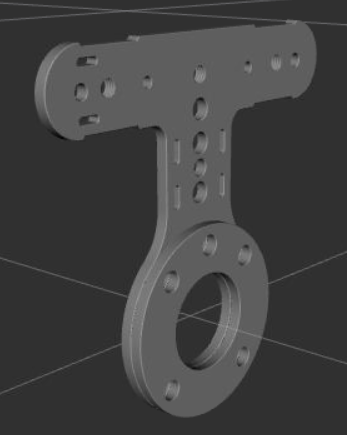
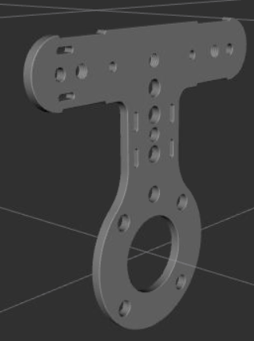
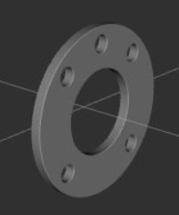
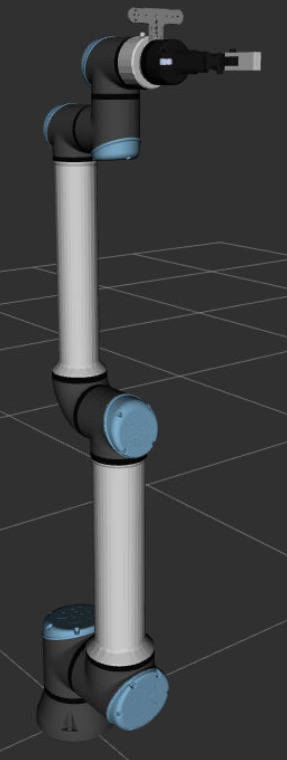
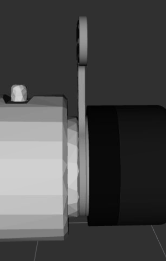
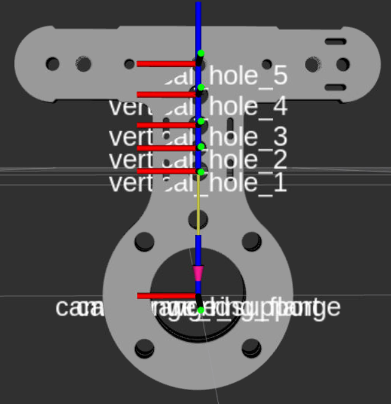
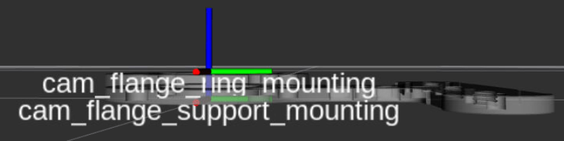

# Cam flange support

This repository integrates the steel camera base support in ROS2.

## Parts

It consists of two pieces, the support itself, and a steel ring to help mounting the piece. 

These two pieces are supposed to be mounted between the robot flange and its tool. With setups like UR robot + Robotiq gripper, the camera support is located on the flange side of the mounting, while the ring is located on the gripper side.

## Auxiliary frames

The repository provides auxiliary TF frames for the different holes in which the camera can be mounted, as well as frames corresponding with the mounting frames, with the Z axis aligned with the robot flange longitudinal axis.

## TODO

- **Visual meshes (.obj) do not seem to be compatible with gazebo**. Simply applying color might fix it, otherwise we might need to export the stls again or use a different file format (.dae).

- Following the previous point, add Gazebo to debug launch file visualizer.launch.py.