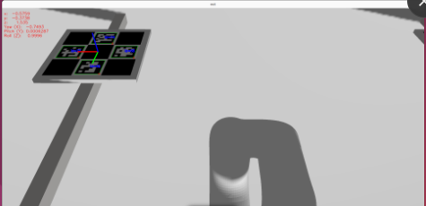
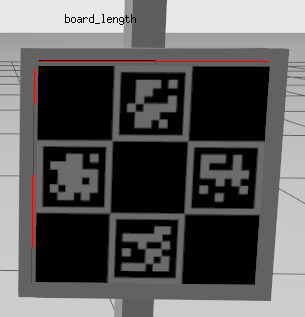
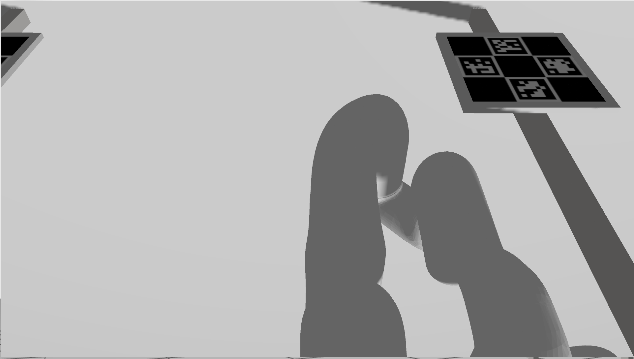
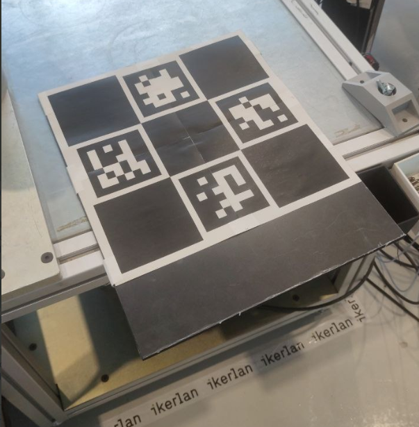
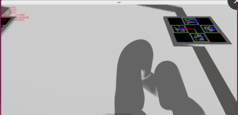

# Camera Positioning

This package performs simple camera positioning based on charuco diamond markers.


## Executables

### `diamond_generator`

Generates an image file containing the calibration pattern, by default the file will be the same as [DiamondImage.jpg](rsc/DiamondImage.jpg).

### `diamond_detector`

Node that performs the detection of the pattern and outputs the transform from the pattern's frame (center of the board) to the specified frame. For this it takes a set of samples and computes the mean and outputs to the console.



#### Parameters

- `board_length` [`double` (m) | default: `0.2`]: The board length.



- `camera_base_frame` [`string` | default: The camera's optical frame]: The frame to give the transform from the board to. Should be a frame fixed wrt. the camera's optical frame. If not specified it will use the frame of the subscribed camera.
- `camera_topic` [`string` | default: `/camera/image`]: The camera topic to subscribe to.
- `sample_number` [`integer` | default: `120`]: Number of samples recorded for the measurement.
- `axis_length` [`double` (m) | default: `0.1`]: Axis length of the frame visualized in the OpenCV window.
- `base_frame` [`string`] | default: The Calibration Board itself: The frame in which the transform to the camera_base_frame is given.
- `board_frame` [`string`]: Must be specified if `base_frame` is set. The TF frame of the calibration board wrt to the base_frame.

## Launch file usage

The launch file camera_positioning.launch.py can be used to launch the diamond_detector executable while setting its parameters. For example:

```bash
ros2 launch camera_positioning camera_positioning.launch.py board_length:=0.225 camera_base_frame:=cam_0_camera_link camera_topic:=/cam_0/zed_node_0/left_raw/image_raw_color base_frame:=link_0 board_frame:=charuco_origin

ros2 launch camera_positioning camera_positioning.launch.py board_length:=0.225 camera_base_frame:=cam_1_camera_link camera_topic:=/cam_1/zed_node_1/left/image_rect_color base_frame:=link_0 board_frame:=charuco_origin
```


## Basic Usage Steps

1. Find a location rigidly linked to the robot's base where a calibration board of a size that will take up a significant part of the image and be fully visible can be placed (see image). This location should be known wrt. the robot's base. To make things easier this position should be reliably reproducible (some fixture for the board) and the resulting location of the calibration target added to the TF tree.



2. Print the calibration board. Remember to make sure that the dimensions of the printed board are correct, some printers may produce unexpected results. Still even if there is some imprecision as long as the proportions are kept (the squares are still squares) the board can be measured and the real dimensions fed to the detector.

> Remember to add a white (or light coloured) area around the board itself.



3. Place the board on its location and run the detector (see above for the parameters). Make sure that the axis shown in the detector's window has the expected orientation (matches the board's expected TF frame) and is stable.



4. Record the obtained transform and use it to update the position of the camera in the environment.

```bash
SAMPLING DONE
Calibration Board -> R_camera_color_optical_frame
Position mean values: (x,y,z) = <x> <y> <z>
Orientation mean values: (R(x),R(y),R(z)) = <Rx> <Ry> <Rz>
```

## Authors and acknowledgment

*In collaboration with Ikerlan S. Coop.*

<a href="https://www.ikerlan.es/">

</a>
